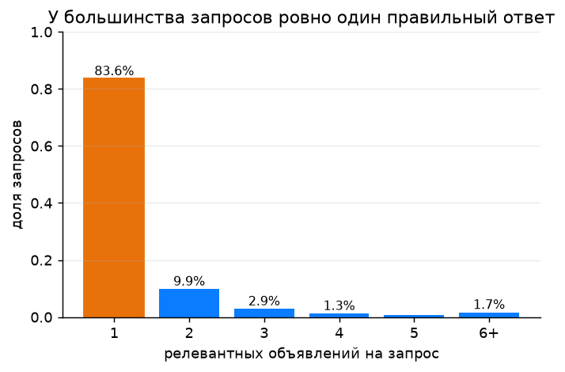
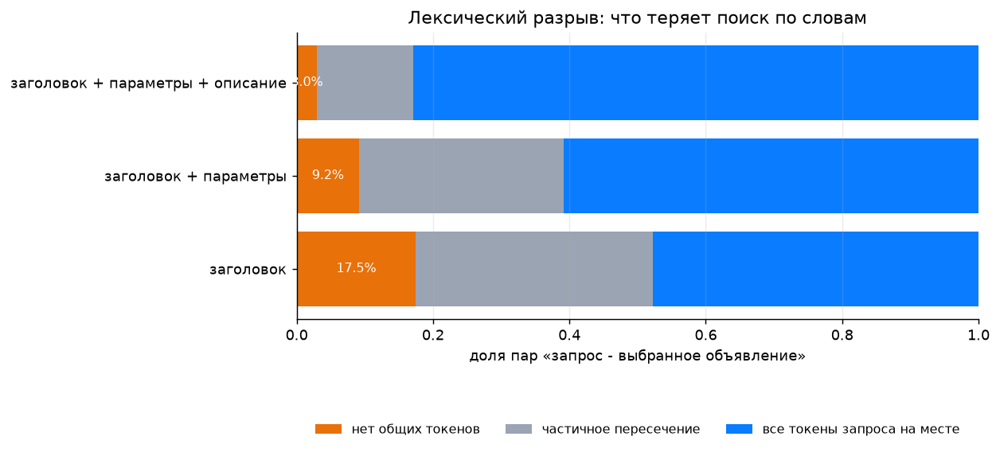
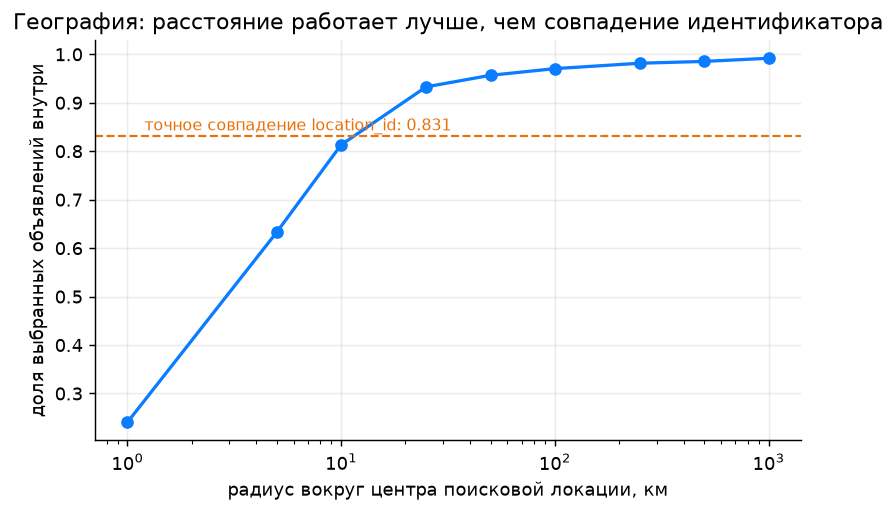
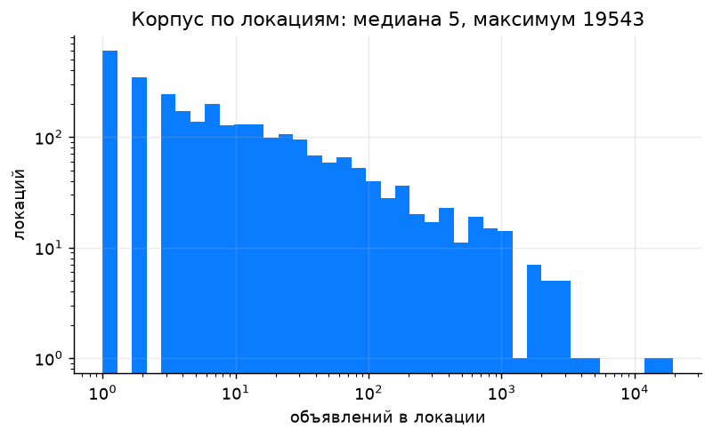
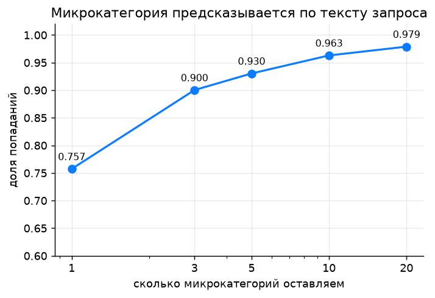
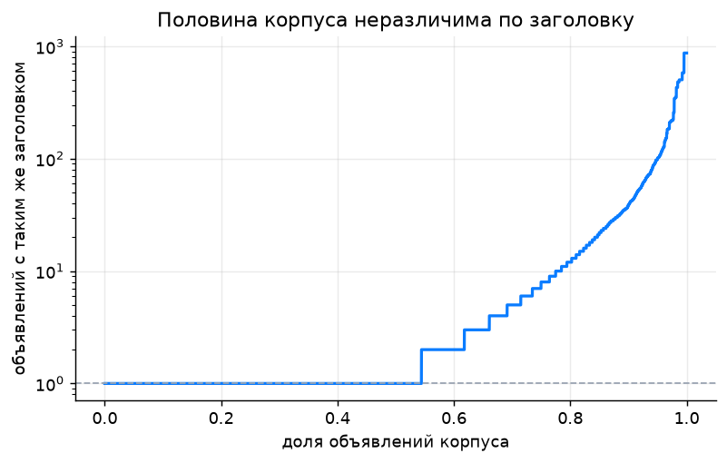
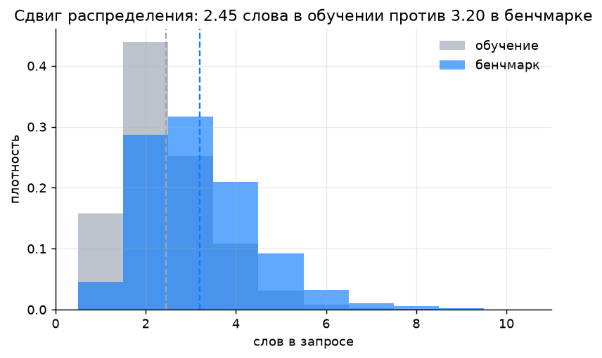
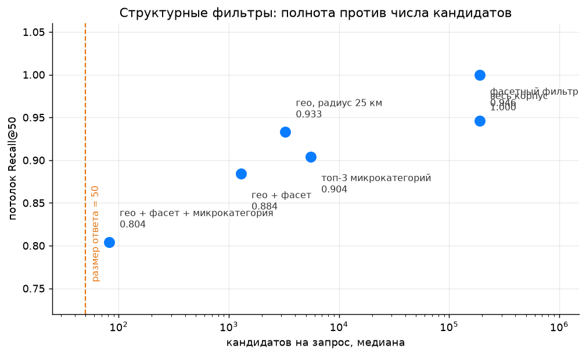
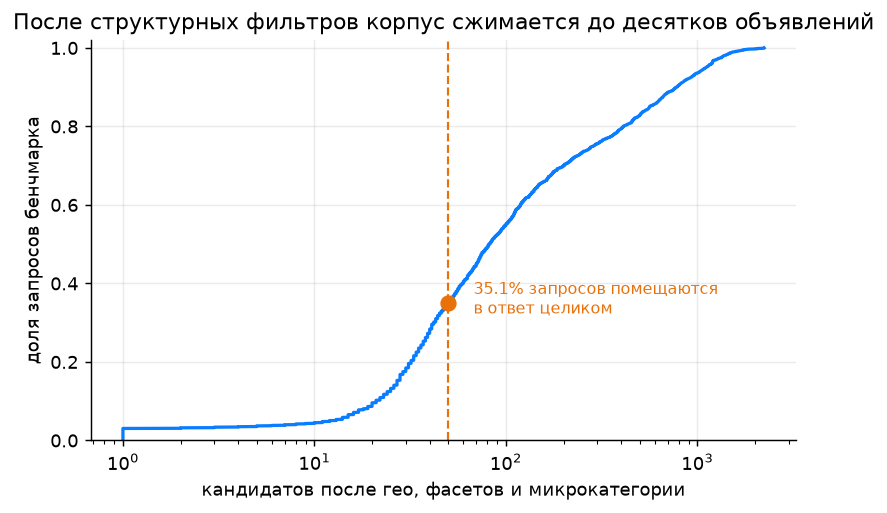

# Разбор данных

Всё, что здесь описано, считается одной командой:

```bash
uv run avito-cg eda
```

Она кладёт числа в `reports/eda.json`, графики в `reports/figures`, полный прогон занимает около
восьми минут на ноутбуке. Код расчётов в [`src/avito_cg/analysis.py`](../src/avito_cg/analysis.py),
рисование в [`src/avito_cg/figures.py`](../src/avito_cg/figures.py).

## Что вообще лежит в файлах

| | train | корпус бенчмарка | запросы бенчмарка |
|---|---|---|---|
| строк | 497 673 | 189 212 | 2 452 |
| уникальных `item_id` | 344 825 | 189 212 | |
| уникальных запросов | 354 463 | | 2 452 |
| размер на диске | 490 МБ | 196 МБ | 0.1 МБ |
| в распакованном виде | 2.2 ГБ | 830 МБ | |

`train.parquet` записан одной row group, поэтому постранично его не прочитать. Зато работает
колоночное чтение, и это спасает: `item_description_raw` в одиночку весит больше половины файла,
а нужен он далеко не всегда.

## 1. Память по объявлениям не работает

Из 189 212 объявлений корпуса в обучающей выборке встречаются 18 142, это **9.6%**. Девять из десяти
объявлений, среди которых надо искать, модель никогда не видела.

Со стороны запросов картина другая: **37.0%** текстов запросов бенчмарка дословно есть в train,
но полный ключ запроса (текст плюс локация плюс фильтры) совпадает только у **4.4%**.

Вывод для архитектуры: таблица «запрос - выбранное объявление» бесполезна как справочник,
но полезна как источник статистик. Знание «по такому запросу выбирают объявления такой
микрокатегории с такими словами в заголовке» переносится на новые объявления, знание «по запросу X
выбирают объявление Y» не переносится никуда.

## 2. Правильный ответ почти всегда один



На уникальный запрос приходится в среднем 1.40 объявления, медиана 1, **у 83.6% ровно одно**.
Максимум 628, но это хвост.

Отсюда два практических следствия. Первое: Recall@50 ведёт себя почти как hit-rate, то есть вклад
запроса это бинарное «попал или не попал». Второе: на выборке в 2 452 запроса стандартная ошибка
такой метрики около 0.01, значит разницу в 0.005 между моделями локально не отличить, и гоняться
за ней бессмысленно. Поэтому в `eval/metrics.py` рядом с метрикой лежит бутстрэп-интервал.

## 3. Лексический разрыв: поиска по словам не хватит



Для каждой пары «запрос - выбранное объявление» я посчитал, какая доля токенов запроса
(после стемминга) встречается в тексте объявления.

| поле объявления | нет общих токенов | все токены на месте | среднее покрытие |
|---|---|---|---|
| заголовок | 17.5% | 47.7% | 0.653 |
| заголовок + параметры | 9.2% | 60.9% | 0.766 |
| заголовок + параметры + описание | **3.0%** | 82.9% | 0.907 |
| только описание | 11.8% | 64.0% | 0.768 |

Первая строка это приговор наивному решению. Если строить BM25 по одному заголовку, то у **17.5%**
пар нет вообще ни одного общего слова с запросом, и никакая настройка весов их не вытащит.
Запрос «обзвон по базе» против заголовка «Холодные звонки, телемаркетинг» пересекается по нулю
токенов, хотя это ровно то, что человек искал.

Описание закрывает разрыв лучше всех остальных полей и в одиночку обходит связку заголовок плюс
параметры. Но описания длинные, медиана 916 символов, p95 почти 3 900. Проверил, где кривая
выходит на полку:

| символов описания в индексе | нет общих токенов | среднее покрытие |
|---|---|---|
| 0 | 9.2% | 0.766 |
| 300 | 5.9% | 0.832 |
| 500 | 5.0% | 0.850 |
| 1000 | 4.1% | 0.875 |
| всё | 3.0% | 0.907 |

Первые 500 символов дают примерно половину выигрыша от описания за пятую часть объёма.
Корпус маленький, так что пока индексирую описание целиком, но с пониженным весом поля,
а обрезку держу как запасной вариант, если упрусь в память.

Даже с полным описанием остаются 3.0% пар, до которых лексический поиск не дотянется в принципе.
Это и есть нижняя граница того, зачем нужны плотные эмбеддинги.

## 4. География: расстояние работает, идентификатор ломается



В 83.1% пар локация поиска совпадает с локацией объявления, и первая мысль это резать корпус
по `location_id`. Мысль плохая: **у 17.4% запросов бенчмарка в их `search_location_id` нет вообще
ни одного объявления корпуса**. Например, по локации 107620 идёт 119 запросов и ноль объявлений.

Причина в том, что `location_id` иерархический: часть запросов приходит с родительского узла
(регион, агломерация), а объявления лежат в дочерних. Структуру иерархии нам не дали, но есть
координаты объявлений, и этого достаточно. Я восстанавливаю центр каждой поисковой локации
как медиану координат объявлений, выбранных в ней по обучающей выборке. Так получились центры
для 2 782 локаций, и **все 100% локаций бенчмарка среди них есть**.

| радиус вокруг центра | доля выбранных объявлений внутри |
|---|---|
| 1 км | 24.1% |
| 5 км | 63.3% |
| 10 км | 81.3% |
| **25 км** | **93.3%** |
| 50 км | 95.7% |
| 100 км | 97.0% |

Радиус 25 км бьёт точное совпадение идентификатора (93.3% против 83.1%) и при этом не оставляет
ни одного запроса без кандидатов. Медиана 3 261 объявление вместо 189 212.



Корпус по локациям разложен крайне неравномерно: медиана 5 объявлений на локацию, максимум 19 543
(это Москва). Поэтому фиксированный радиус для всех запросов это компромисс, и в решении
расстояние идёт не жёстким отсечением, а признаком.

## 5. Фильтры поиска это почти жёсткое ограничение

`search_infm_params_text` выглядит как текст, но ведёт себя как фасетный фильтр. Дословного
совпадения строк ждать не стоит, потому что со стороны запроса ключ называется
«Тип услуги автосервиса», а со стороны объявления «Тип услуги». Поэтому сравниваю по токенам.

На 333 674 парах с непустым фильтром:

- среднее покрытие токенов фильтра параметрами объявления **0.969**
- полное покрытие у **92.0%** пар
- нулевое покрытие у **0.07%** пар
- а вот дословным вхождением строки фильтра в строку параметров - только у **53.8%**

Последняя строка и есть обоснование того, почему сравнение идёт по токенам: половина пар
сравнением строк не ловится вовсе, хотя по смыслу фильтру удовлетворяет.

То есть если человек выставил фильтр, выбранное им объявление почти наверняка этому фильтру
удовлетворяет. Но «почти» тут стоит 8 процентных пунктов, поэтому жёстко резать по фасетам нельзя,
они идут бонусом к скору.

### Как я разобрал параметры

`item_infm_params_text` приходит одной слипшейся строкой без разделителей, в среднем 974 символа:

```
Вид услуги Автосервис, аренда Тип услуги Аренда авто Место оказания услуг
Санкт-Петербург, Невский пр-т, 190 Тип транспорта Водный транспорт
```

Значения многословные и с запятыми внутри, ключи повторяются, часть ключей это булевы флаги
без значения. Захардкодить словарь ключей нельзя: он свой в каждой из 752 микрокатегорий.

Ключи ищу непараметрически, через **энтропию ветвления**. Настоящий ключ стоит на границе двух
сущностей, поэтому слева от него встречаются концы самых разных значений, а справа начинаются
самые разные значения. У куска внутри значения контекст предсказуемый: у «оказания услуг» слева
почти всегда «Место», у «Место оказания» справа почти всегда «услуг», и оба отсеиваются.

Поверх энтропии пришлось поставить ещё четыре условия, без них словарь засоряется:

- **минимальность**: ключ не может содержать внутри себя другой ключ, иначе в словарь лезут
  склейки вида «Марка авто Audi Марка авто»
- **цифры и запятая на хвосте** это всегда кусок значения или адреса
- **начало строки это граница**, а не однообразный сосед. Без этой оговорки из словаря
  вылетал «Вид услуги», который открывает 99% строк
- **второй проход с маскированием адреса**: внутри адреса контекст такой же разнообразный,
  как на границе ключей, поэтому первый проход тащит в словарь названия улиц («Карла», «Северная»).
  Вырезаю значение ключа «Место оказания услуг» и ищу заново

Итог: **96 ключей**, медиана 12 ключей на объявление, медиана длины значения 1 слово,
**99.0%** строк корпуса начинаются с ключа (проверяется командой `avito-cg param-keys`).
Метод не идеальный: жёсткие пары вроде «Тип стоимости за услугу / Начальная цена» энтропия
не разделяет, потому что они всегда идут вместе, а редкие ключи вроде «Тип транспорта»
не набирают частоты и уезжают внутрь значения соседа. Для фасетного матчинга и очистки
текстового индекса этого хватает.

Один важный момент про воспроизводимость. Результат вывода зависит от того, на каком корпусе
его выводить: по `benchmark_items` получается 99 ключей, по локальному корпусу из `train` 92,
и расходятся они на три десятка. Поэтому словарь не выводится заново в каждой команде,
а лежит закреплённым в пакете (`src/avito_cg/data/param_keys.json`) и версионируется
вместе с кодом - иначе поле `params` индекса, а за ним и `answer.csv`, зависели бы от того,
какую команду запустили первой.

## 6. Микрокатегория предсказывается по тексту запроса



`search_category` и `item_category_id` равны 114 почти везде, толку от них ноль. Реальная
таксономия одна, это `item_microcat_id`.

Сначала проверил, есть ли там сигнал вообще. Для запросов, которые встречались в обучении
хотя бы трижды, распределение микрокатегорий выбранных объявлений оказалось узким: на самую
частую приходится в среднем 82.1% выборов, медиана 90%, средняя энтропия 0.59 бита,
а у 42.7% запросов микрокатегория вообще одна.

Дальше обучил наивный байес на символьных n-граммах текста запроса, с разбиением по уникальным
текстам, чтобы не мерить на тех же запросах:

| оставляем микрокатегорий | доля попаданий | объявлений корпуса внутри, медиана |
|---|---|---|
| 1 | 75.7% | 1 873 |
| 3 | 90.0% | 5 551 |
| 5 | 93.0% | 8 766 |
| 10 | 96.3% | 15 802 |

Это десять строк кода и полминуты обучения, то есть оценка снизу. Нормальная модель будет лучше.

Отдельная находка: в обучении встречаются **212 микрокатегорий, а в корпусе 752**. Но 546 незнакомых
микрокатегорий это всего 1 758 объявлений, то есть **99.1% корпуса лежит в знакомых категориях**.
Значит незнакомые можно смело опускать вниз, риск минимальный.

## 7. Половина корпуса неразличима по тексту



**48.6%** объявлений корпуса делят заголовок хотя бы с одним другим объявлением. Рекордсмены:

| заголовок | объявлений |
|---|---|
| наращивание ресниц | 873 |
| репетитор по английскому языку | 582 |
| маникюр | 504 |
| массаж | 503 |
| грузоперевозки | 482 |

Насколько объявление вообще опознаваемо:

| по чему различаем | доля однозначно опознаваемых объявлений |
|---|---|
| заголовок | 51.4% |
| заголовок + локация | 89.0% |
| заголовок + локация + микрокатегория | 89.9% |

Это принципиальное ограничение, а не недоработка модели. Если по запросу «маникюр» в корпусе
лежат пятьсот объявлений с этим же заголовком, то текстовая часть решения не может выбрать
из них правильное, и работать должны гео, цена, рейтинг и число отзывов. Локация вытягивает
различимость с 51% до 89%, микрокатегория поверх неё добавляет меньше процента.

Второе следствие мне тогда показалось очевидным, и оно оказалось неверным. Я написал, что
дубли будут занимать слоты в топ-50 и что в конце нужна диверсификация. **Диверсификации
в решении нет, и не должно быть.** Пятьдесят одинаковых по тексту объявлений это пятьдесят
разных `item_id`, и правильным может оказаться любое из них: выкидывать «дубль» значит
выкидывать кандидата ровно с той же вероятностью быть ответом, что и у оставленного.
Метрика при этом за лишних кандидатов не штрафует. Проверять это замером не пришлось,
достаточно было сформулировать: «дубль» тут свойство текста, а не объявления.

Что действительно следует из этой таблицы - объявления-близнецы должно разводить что-то
помимо текста, и этим занимается гео. Разбор промахов финальной конфигурации показал,
что вопрос закрыт: доля попаданий по числу близнецов плоская, 0.933 при одном экземпляре
против 0.911 при сотне и больше, размер эффекта -0.012.

## 8. Запросы бенчмарка не такие, как в обучении



| величина | обучение | бенчмарк |
|---|---|---|
| слов в запросе, среднее | 2.45 | **3.20** |
| доля пустых фильтров | 35.2% | **63.1%** |
| доля поиска с доставкой | 0.003% | 0% |

Двухвыборочный тест Колмогорова-Смирнова по длине запроса даёт статистику 0.266, и это тот
редкий случай, когда тест действительно что-то решает: расхождение такого размера не объясняется
шумом при таких объёмах, и оно меняет конструкцию валидации.

Запросы бенчмарка длиннее и реже сопровождаются фильтрами. Что это значит:

- бенчмарк смещён в сторону редких длинных запросов, а не головы вроде «маникюр».
  Задача от этого сложнее для лексического поиска и приятнее для плотного
- фасетный матчинг применим только к 37% запросов бенчмарка против 65% обучающих,
  то есть его вес в общем скоре будет ниже, чем кажется по обучению
- локальную выборку отложенных запросов надо перевзвешивать под маргинальные распределения
  бенчмарка, иначе метрика будет мерить не то. Подробности в [VALIDATION.md](VALIDATION.md)

`search_is_delivery_search` в бенчмарке равен нулю у всех 2 452 запросов, признак вырожден
и в решении не используется.

## 9. Смещение выбора по цене и рейтингу почти отсутствует

| признак | медиана у выбранных | медиана в корпусе | дельта Клиффа |
|---|---|---|---|
| рейтинг | 5.0 | 5.0 | -0.023 |
| число отзывов | 25 | 18 | **+0.116** |
| цена | 1 000 | 1 000 | -0.029 |

Здесь важнее методика, чем результат. На полумиллионе наблюдений критерий Манна-Уитни выдаёт
исчезающе малое p-value для любой из трёх величин, включая те, где медианы совпадают до знака.
Поэтому я смотрю не на значимость, а на размер эффекта: дельта Клиффа 0.02 это шум, который просто
стал «значимым» от объёма выборки, а 0.12 это слабый, но реальный сдвиг.

Читается так: пользователи слегка тянутся к объявлениям с большим числом отзывов, а по цене
и рейтингу заметного предпочтения нет. Рейтинг вообще почти неинформативен, у медианного
объявления он равен 5.0. Значит число отзывов идёт в переранжирование как слабый признак,
а рейтинг и цена только в паре с другими.

Оговорка: пулы разные. Обучение это выбранные объявления за какой-то период, корпус это срез
бенчмарка, так что часть различий объясняется составом пулов, а не поведением людей.

## 10. Главная таблица: чем платим за сокращение корпуса



Слева потолок полноты, посчитанный на парах обучения: доля выбранных объявлений, которые фильтр
пропускает. Справа число выживших кандидатов, посчитанное на настоящем корпусе для настоящих
запросов бенчмарка.

| фильтр | потолок Recall@50 | кандидатов, медиана | p90 |
|---|---|---|---|
| весь корпус | 1.000 | 189 212 | 189 212 |
| фасетный фильтр | 0.946 | 189 212 | 189 212 |
| гео, радиус 25 км | 0.933 | 3 261 | 25 802 |
| топ-3 микрокатегорий | 0.904 | 5 551 | 8 725 |
| гео + фасет | 0.884 | 1 290 | 25 802 |
| **гео + фасет + микрокатегория** | **0.804** | **82** | **779** |

У фасетного фильтра медиана равна размеру корпуса, потому что 63% запросов бенчмарка идут вообще
без фильтра, и для них он ничего не ограничивает.

Три структурных фильтра сжимают корпус в две с лишним тысячи раз, с 189 212 до медианных 82
кандидатов, и платят за это 19.6 процентными пунктами полноты.



| после всех фильтров осталось | доля запросов бенчмарка |
|---|---|
| не больше 50 | 35.1% |
| не больше 200 | 69.9% |
| не больше 1 000 | 93.6% |

Для трети запросов отфильтрованное множество целиком помещается в ответ. Для них ранжирование
вообще не нужно, достаточно отдать всё что есть.

**Как я это использую.** Жёстко резать по этим фильтрам нельзя, 19.6% потери это слишком дорого
при метрике на полноту. Значит фильтры дают не отсев, а сильные признаки и приоритет.

Первоначально я расписал здесь схему из трёх шагов - отдавать целиком то, что осталось после
фильтров, а оставшиеся слоты добирать текстом, резервируя часть под кандидатов снаружи.
**В решение она не пошла, и это осознанный отказ.** Схема с резервированием слотов это ручная
дисциплина над бюджетом ответа, у неё три-четыре параметра, подбирать их не на чем, и она
решает ту же задачу, что и калиброванное слияние, только хуже: слияние складывает все сигналы
в один скор в общих единицах и само отдаёт лучшие 50, без деления кандидатов на сорта.
Ровно этот вариант и измерен - строки 2a-4b журнала экспериментов.

## Что из этого следует для решения

| Находка | Что делаю |
|---|---|
| 90% корпуса не встречалось в обучении | решение контентное, память по `item_id` не строю |
| 17.5% пар не пересекаются с заголовком по словам | описание и параметры обязательно в индекс |
| 3% не пересекаются даже с полным текстом | плотные эмбеддинги как отдельный источник кандидатов |
| у 17.4% запросов локация пустая | гео через координаты и расстояние, а не через `location_id` |
| фильтр покрывается параметрами у 92% пар | фасетный матчинг как сильный признак, не как отсев |
| микрокатегория предсказуема на 90% в топ-3 | классификатор запроса как приор |
| 48.6% корпуса неразличимы по заголовку | гео и поведенческие признаки в переранжирование, диверсификация ответа |
| запросы бенчмарка длиннее и без фильтров | перевзвешивание локальной валидации |
| один правильный ответ на запрос | доверительные интервалы обязательны, микроприросты игнорирую |
